# WhatsWave Flutter

A full-featured, real-time messaging app built in Flutter -- chats and groups, status updates, communities, and voice/video calling, with a WhatsApp-inspired UI.

## Demo

Running on the iOS Simulator (iPhone 17 Pro).

[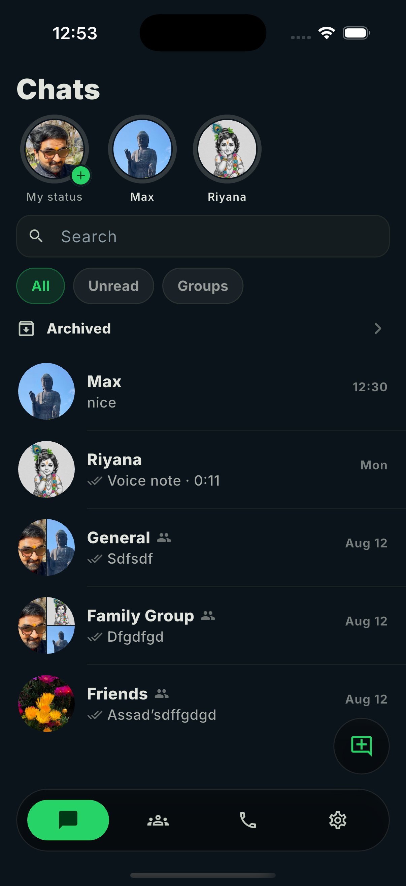](docs/demo/whatswave-demo.mp4)

<sub>▶️ Click the screenshot above (or [this link](docs/demo/whatswave-demo.mp4)) to watch/download the full screen recording.</sub>

| Auth | Profile setup | Chats list | Chat detail |
|---|---|---|---|
| 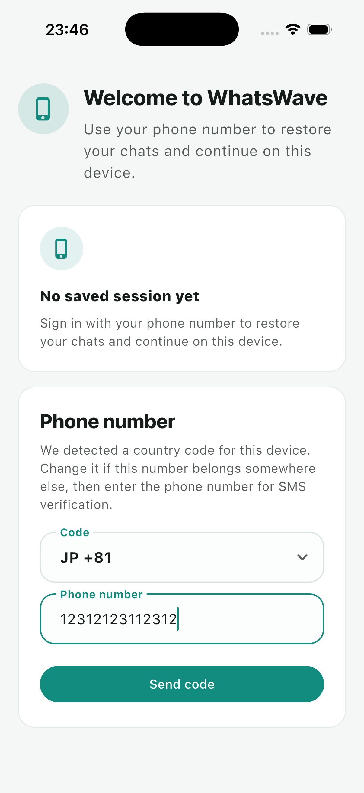 | 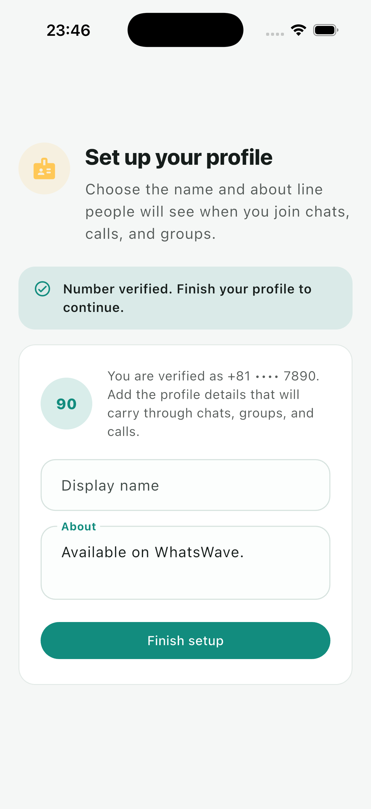 |  | 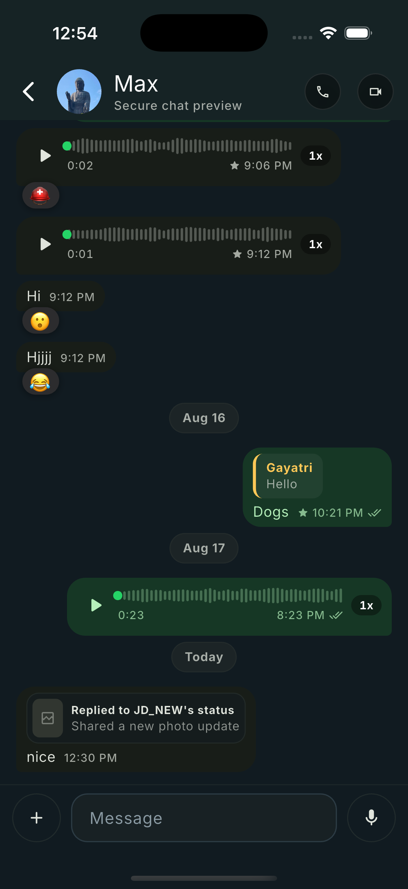 |

| Live video call | Group video call | Communities | Calls |
|---|---|---|---|
| 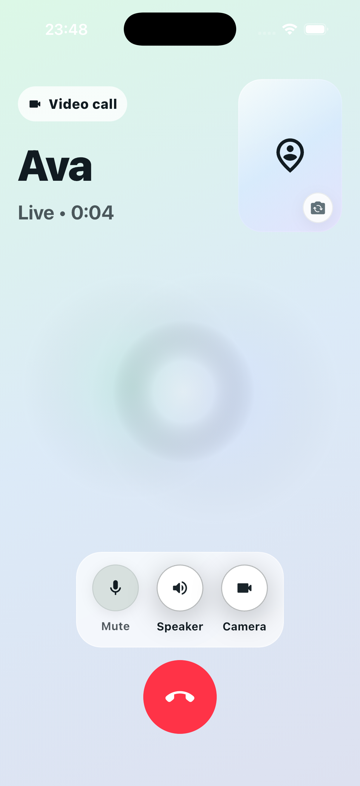 | 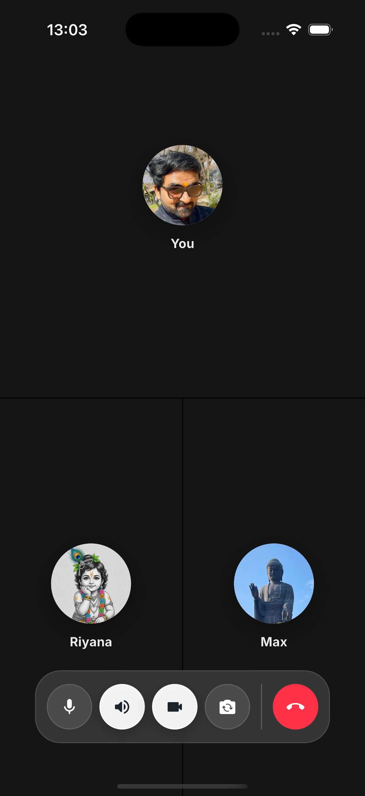 | 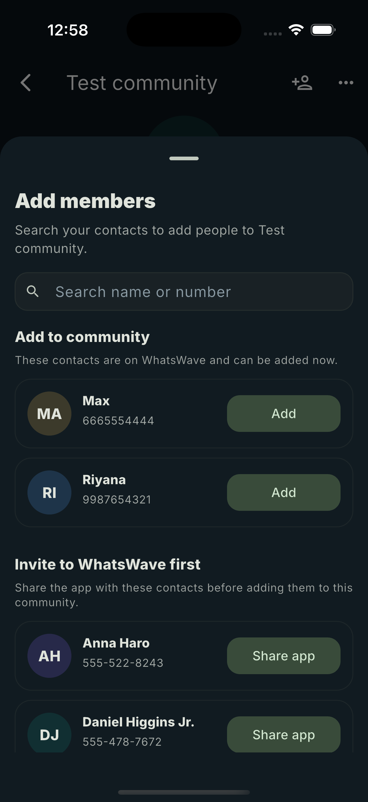 | 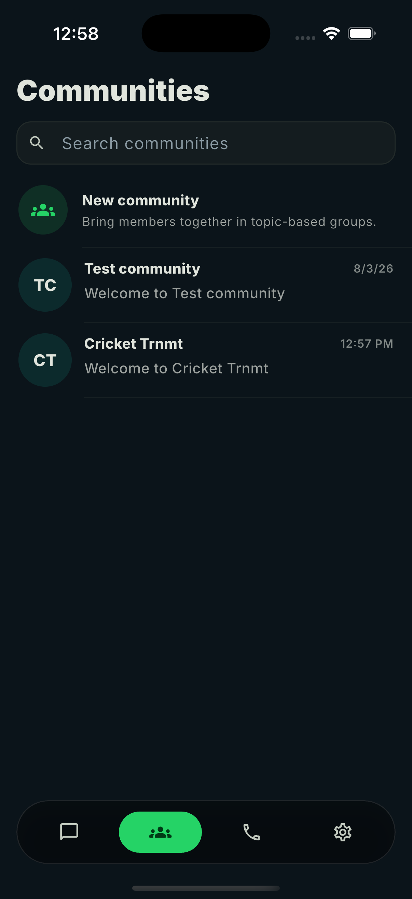 |

| Settings | Draw tool | Crop tool | Music picker |
|---|---|---|---|
| 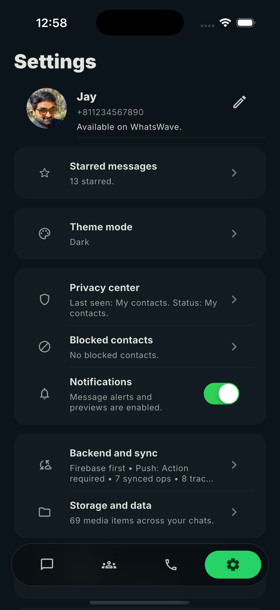 | 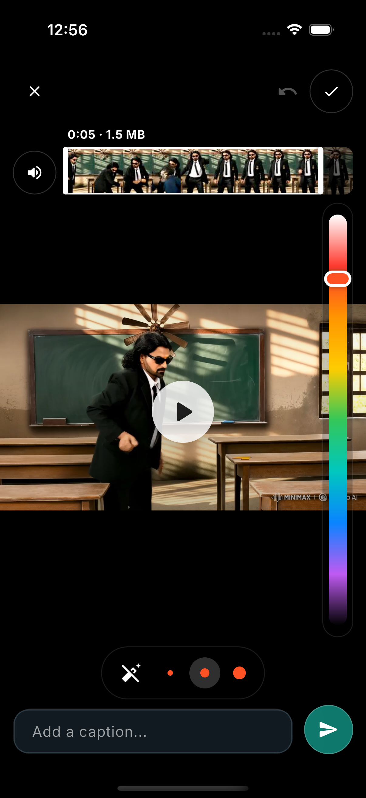 | 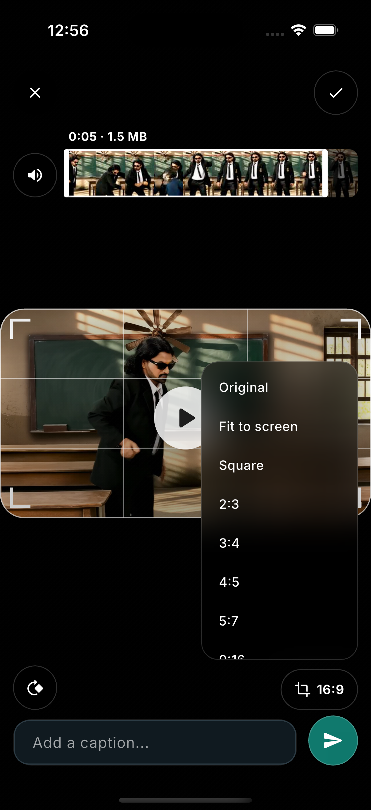 | 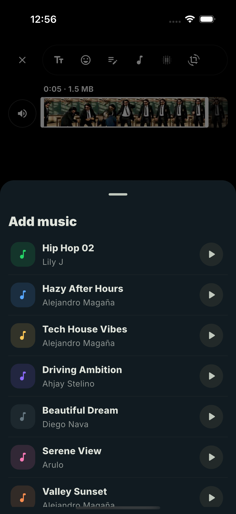 |

| Group info | Contact info | Text status |
|---|---|---|
| 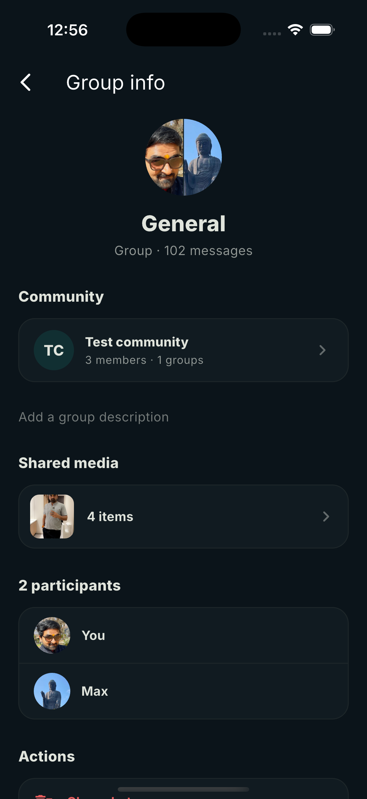 | 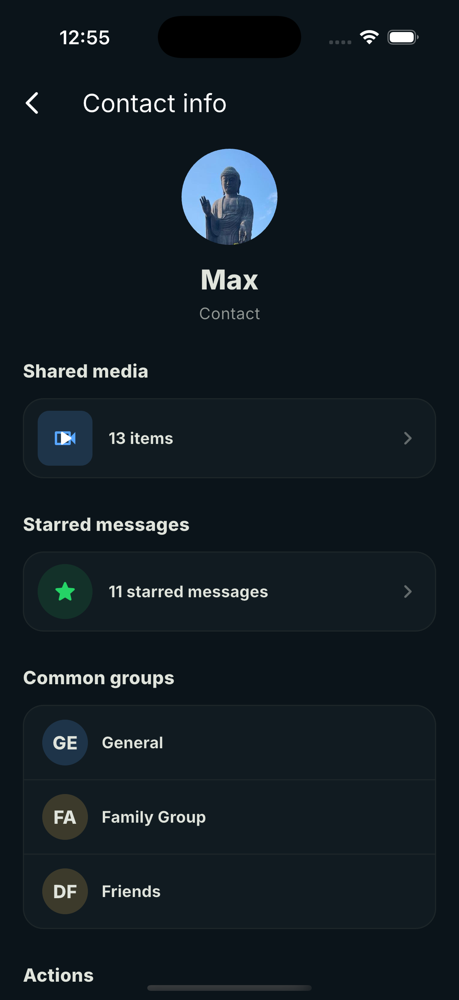 | 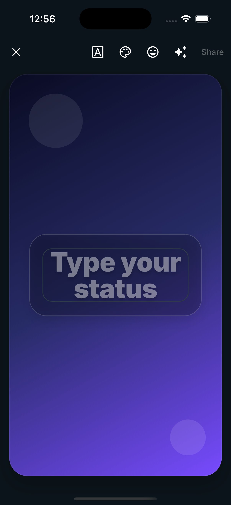 |

<sub>The status composer's draw, crop, and music tools (above) load their music catalog live from Firestore/Storage.</sub>

## Features

- **Chats** -- 1:1 and group conversations with search, filters, archiving, reply/forward/star/multi-select, in-chat search, a pre-send media review screen (caption, rotate, freehand markup), and hold-to-record voice notes with a waveform scrubber
- **Status updates** -- story rings, per-viewer lists with like state, and a rich composer: text/photo/video status with draw, blur, crop/rotate, stickers, emoji, and a shared music catalog to set behind a story
- **Calls** -- 1:1 audio/video calling and real multi-party group video calls, with a live video grid, call history, and favorites
- **Communities** -- grouped communities with member management, announcements, linked group chats, and invite/share flows
- **Contacts** -- device contact sync matched against registered accounts
- **Settings** -- profile editing, a privacy center, notification preferences, and an app lock
- **Light and dark themes** with a soft, liquid-glass-style tab bar and screen transitions

## Tech stack

| Layer | Choice |
|---|---|
| Framework | Flutter (iOS + Android) |
| Auth | Firebase Authentication (phone/OTP) |
| Data | Cloud Firestore |
| Media storage | Firebase Storage |
| Calling | LiveKit (real-time audio/video, group rooms) |
| Push | Firebase Cloud Messaging / APNs |
| Crash & analytics | Firebase Crashlytics, Firebase Analytics |
| Contacts | `flutter_contacts`, matched against a Firestore phone directory |

Every backend integration sits behind a repository interface (`AuthRepository`, `ChatRepository`, `StatusMusicRepository`, etc.), so the app also runs entirely offline on seeded local data with no credentials required -- useful for UI development and demos.

## Architecture

Each feature is organized as a vertical slice with a consistent internal shape:

```text
lib/
  app/                 # App shell, routing, top-level wiring
  core/                # Shared models, theming, integrations
  features/
    auth/
    chats/
    updates/
    calls/
    communities/
    settings/
    shell/
      presentation/    # Screens and widgets
      application/     # Controllers (state + business logic)
      domain/          # Models and repository interfaces
      data/            # Repository implementations (local + Firebase)
test/
docs/
```

A screen only ever talks to a controller, and a controller only ever talks to a repository *interface* -- it never knows whether the concrete implementation is a local seeded adapter or a real Firebase/LiveKit one. This keeps the UI fully testable and demoable without live credentials, and keeps backend swaps (or a future provider) isolated to the `data/` layer.

## Design direction

The app shell follows common social and messaging app patterns:

- Story-style update rings and recent updates surfaces
- A clean, organized settings/profile layout
- Dense but readable chat list cards
- Call history and favorites with quick actions
- Light and dark themes tuned for messaging use

## Getting started

### Prerequisites

- Flutter SDK, Xcode, CocoaPods (iOS), Android Studio + SDK + a JDK (Android)

```bash
flutter doctor -v
```

### Install and run

```bash
flutter pub get
flutter devices
flutter run -d "iPhone 17 Pro"
```

The app runs fully on seeded local data by default -- no Firebase credentials required to explore the UI. To try it against a real Firebase backend instead, see `config/README.md` for the setup steps and available `--dart-define` flags.

### Useful commands

```bash
flutter analyze                # Static analysis
flutter test                   # Unit + widget tests
flutter emulators               # List available simulators/emulators
flutter emulators --launch <id> # Launch one
```

### Recommended development device matrix

To keep responsive issues visible while developing, test on one compact and one larger target per platform:

- iOS compact: `iPhone SE (3rd generation)`
- iOS large: `iPhone 17 Pro`
- Android compact: `Small_Phone`
- Android medium: `Medium_Phone_API_35`

## Layout guidelines

UI must never clip, overflow, or hide content at any screen size or accessibility text scale. See `docs/ui_layout_guidelines.md` for the full set of layout rules this codebase follows.
