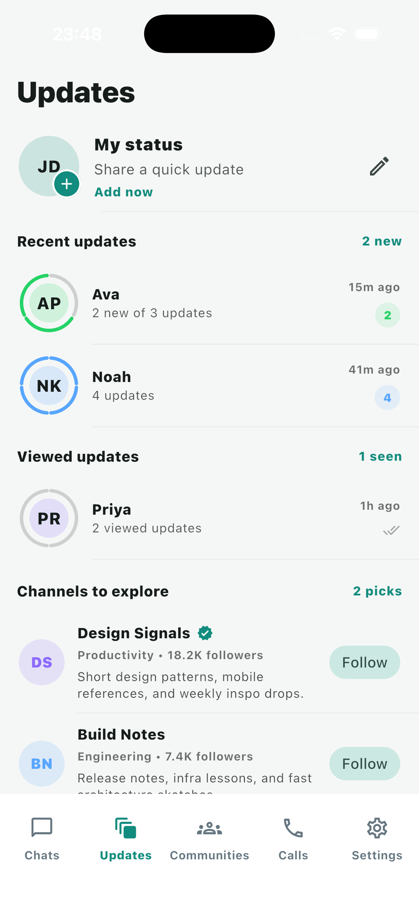
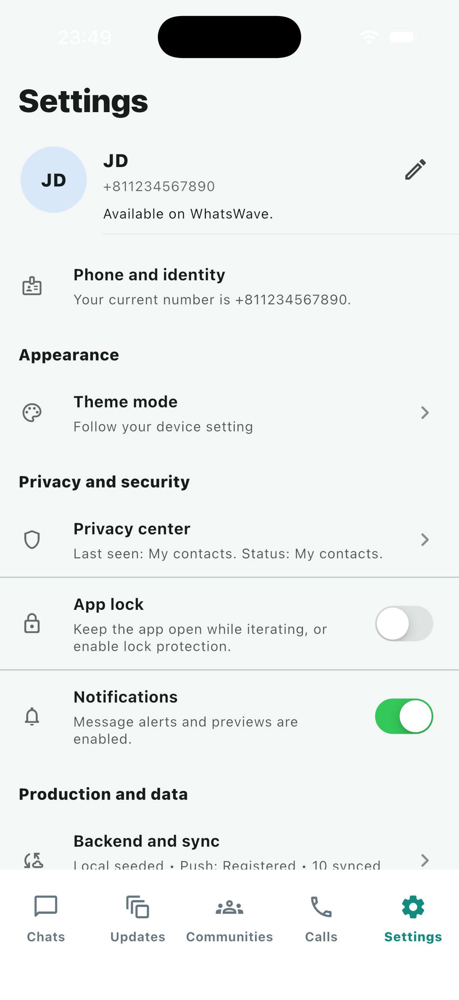

# WhatsWave Flutter

`WhatsWave Flutter` is a brand-new Flutter codebase for a WhatsApp-style messaging app. It is intentionally separate from the existing iOS Swift project and does not modify that app.

## Demo

Running on the iOS Simulator (iPhone 17 Pro).

[](docs/demo/whatswave-demo.mp4)

<sub>▶️ Click the screenshot above (or [this link](docs/demo/whatswave-demo.mp4)) to watch/download the full screen recording.</sub>

| Auth | Profile setup | Chats list | Chat detail |
|---|---|---|---|
|  |  |  |  |

| Live video call | Updates | Communities | Settings |
|---|---|---|---|
|  |  |  |  |

This repository is being built in small, reviewable phases:

1. Architecture, project setup, and design foundation
2. Shared app shell and visual system
3. Auth and onboarding
4. Chats, groups, composer, attachments, and viewers
5. Updates/status, stories, and channels
6. Calls, calling flows, and provider adapters
7. Communities, contacts, and discovery
8. Settings, profile, app lock, and preferences
9. Backend adapters, push, sync, and offline hardening
10. Expanded happy/sad path test coverage

## Current phase

This repo currently includes:

- A full Flutter project scaffold with generated `android/` and `ios/` runners
- Architecture and implementation planning docs
- A themed app shell with light and dark mode support
- A splash/session gate with fake session restore
- Phone entry, OTP verification, and profile bootstrap auth flow
- A controller-driven chats slice with search, filters, archive, thread navigation, composer actions, and attachment previews
- A controller-driven updates slice with story rings, viewer flow, status composition, and viewed/unviewed state
- A controller-driven calls slice with favorites, history, seeded incoming/outgoing audio-video flows for UI development, permission prompts, and active call UI
- A controller-driven communities and contacts slice with search, filters, permission gating, create-community flow, detail screens, and invite/share actions
- A controller-driven settings slice with persisted preferences, profile editing, a privacy center, and a lifecycle-aware app lock overlay
- A backend and sync center with vendor-neutral push registration, observed repository activity, a local media transfer pipeline, and injectable provider contracts that keep Firebase and AWS seams clean
- Runtime-selected repository bundles so local seeded adapters remain stable while Firebase-first and AWS-ready repository boundaries are scaffolded
- A shared observability seam that captures app, shell, and calling breadcrumbs locally and is ready to swap for a release telemetry provider
- Unit and widget tests for the foundation, auth/session flow, chats, updates, calls, communities, settings, and security layers

## Backend status

The app runs in two modes, switched at launch via `WW_BACKEND_TARGET` (see `config/README.md`) -- `local` is always the default, `firebase` opts into the adapters below. Every repository sits behind an interface (`AuthRepository`, `ChatRepository`, etc.), so switching modes never touches a screen.

| Feature | Local mode | Firebase mode |
|---|---|---|
| Auth | Seeded fake phone/OTP flow | **Real Firebase Phone Auth** (SMS/reCAPTCHA verification, session persistence) |
| Chats | Seeded fake threads | **Real Cloud Firestore** (per-thread participant security rules) |
| Updates/Status | Seeded fake stories | **Real Cloud Firestore** for metadata; photo/video stay device-local (no Cloud Storage yet -- see below) |
| Communities | Seeded fake communities + contacts | **Real Cloud Firestore** for communities; **real device contacts** (`flutter_contacts`) matched against registered accounts via a `phoneDirectory` collection |
| Calls | Simulated (Timers, no real transport) | **Real calling** for any contact with a known uid -- real Firestore signaling (ring/accept/decline/end) plus a real LiveKit room with live local/remote video, reachable from Communities' Voice/Video call buttons on contacts confirmed "on WhatsWave". Contacts without a matched uid (e.g. the Calls tab's demo favorites) still use the original simulated flow, unchanged |
| Crashlytics / Analytics | Local in-memory breadcrumbs only | **Real Crashlytics + Analytics** (crash capture/upload verified; stack-trace symbolication disabled, see below) |
| Push (FCM/APNs) | Not implemented | **Real FCM token registration** (permission request, token fetch, written to `pushTokens/{uid}`) -- see below for a Simulator-specific limitation |

Known, deliberate scope decisions (each documented in the relevant repository/service file):
- Status media (photos/videos) stays on-device rather than uploading to Firebase Storage, to avoid requiring the pay-as-you-go Blaze billing plan for a portfolio project.
- Cross-user visibility (seeing someone else's chat/story/community) only really applies once a second real account exists to test against -- the write-security rules are in place, but only exercised by a single test account so far.
- Crashlytics crash reports upload successfully but aren't automatically symbolicated -- `flutterfire configure`'s generated Xcode build phase assumes a Swift Package Manager checkout layout that didn't match this machine's Xcode version and broke every build, so it was reverted. See `FirebaseAppTelemetry`'s doc comment for the full story and a manual fallback.
- Device-contact phone matching is a best-effort trailing-digits comparison, not real E.164 parsing -- see `core/utils/phone_number_matching.dart`.
- iOS Simulators cannot obtain a real APNs token (needs real hardware talking to Apple's push servers) -- push registration correctly reports "action required" there rather than crashing. Testing a real token needs a physical iOS device or the Android emulator. Sending pushes (not just registering for them) still needs a Cloud Function, which needs Blaze.
- LiveKit's camera capture also needs real hardware -- the iOS Simulator has no `AVCaptureDevice`, so real calls (and the debug test screen) catch that failure as a non-fatal warning and still confirm the room connection and mic track. Video needs a physical device on at least one side.
- Real calling has two known gaps, both documented inline in `CallsController`: an incoming call shows a placeholder caller name (`"Caller xxxx"`) since there's no contact-name resolution for an arbitrary caller uid yet, and a second simultaneous incoming call is silently ignored rather than queued or auto-declined.

For the full setup story (Firebase console steps, `flutterfire configure`, local secrets), see `docs/handoff/03_firebase_dev_setup.md` and `config/README.md`.

## Project structure

```text
lib/
  app/
  core/
  features/
test/
docs/
```

### Architecture shape

Each feature is intended to grow into a vertical slice:

```text
features/
  chats/
    presentation/
    application/
    domain/
    data/
```

The phase-1 code keeps runtime dependencies minimal and uses seeded local data so we can harden architecture and UI before wiring Firebase or AWS.

## Local setup

### 1. Install Flutter tooling

On macOS, make sure Flutter, Xcode, CocoaPods, Android Studio, the Android SDK, and a JDK are installed, then run:

```bash
flutter doctor -v
```

### 2. Fetch packages

From this project folder:

```bash
flutter pub get
```

### 3. Run the app

```bash
flutter devices
flutter run -d "iPhone 17 Pro"
flutter run -d emulator-5554
```

To launch directly into a restored demo session for manual shell/chat QA:

```bash
flutter run -d emulator-5554 --dart-define=WW_DEMO_RESTORE_SESSION=true
```

To keep a local build closer to release behavior while still using debug tooling:

```bash
flutter run -d emulator-5554 --dart-define=WW_ENABLE_DEMO_SURFACES=false
```

To preview the Firebase-first scaffolding without wiring live credentials yet:

```bash
flutter run -d emulator-5554 \
  --dart-define=WW_BACKEND_TARGET=firebase \
  --dart-define=WW_APP_ENV=development
```

#### Easier alternative: `config/dev.json`

Instead of retyping `--dart-define` flags, copy `config/dev.json.example` to
`config/dev.json` (gitignored, local-only) and run:

```bash
flutter run --dart-define-from-file=config/dev.json
```

See `config/README.md` for the full key reference. You'll also need your own
Firebase config for Firebase mode — see
`docs/handoff/03_firebase_dev_setup.md`.

### 4. Launch simulators and emulators

List the available emulator IDs:

```bash
flutter emulators
```

Verified locally on this machine:

- `apple_ios_simulator`
- `Small_Phone`
- `Medium_Phone_API_35`

Launch an iOS simulator:

```bash
flutter emulators --launch apple_ios_simulator
```

Launch an Android emulator:

```bash
flutter emulators --launch Small_Phone
```

After the device is booted, confirm the target ID:

```bash
flutter devices
```

### 5. Run checks

```bash
flutter analyze
flutter test
```

### Recommended development device matrix

To keep responsive issues visible while developing new features, keep one compact and one larger target open on each platform:

- iOS compact: `iPhone SE (3rd generation)`
- iOS large: `iPhone 17 Pro`
- Android compact: `Small_Phone`
- Android medium: `Medium_Phone_API_35`

The widget suite now covers the auth flow and the main shell across a compact and larger iPhone/Android size matrix, so `flutter test` will catch a large class of spacing and overflow regressions before manual QA.

### 6. Android JDK note

If Android builds fail on a managed network with SSL or certificate errors, point Flutter at a trusted local JDK before building:

```bash
flutter config --jdk-dir /Library/Java/JavaVirtualMachines/jdk-17.jdk/Contents/Home
```

Then rerun:

```bash
flutter doctor -v
```

## Troubleshooting

Release hardening guidance now lives in `docs/release_readiness.md`, and the automated quality gate lives in `.github/workflows/flutter_ci.yml`.

## Handoff bundle

For moving this project to another machine, another developer, or another AI tool, start with:

- `PROJECT_BRIEF_FOR_NEW_DEVELOPER.md`
- `TRANSFER_TO_NEW_PC.md`
- `docs/handoff/README.md`

That bundle includes:

- current project state
- machine bootstrap steps
- Firebase dev setup guidance
- AWS path guidance
- development guardrails
- testing and QA handoff
- an AI resume brief

## Backend runtime flags

The app now exposes a runtime backend configuration layer so Phase 8 work can move forward before live provider credentials are added.

- `WW_BACKEND_TARGET=local|firebase|aws`
- `WW_APP_ENV=local|development|staging|production`
- `WW_CALL_PROVIDER=simulated|livekit|twilio|agora|stream|self_managed`
- `WW_USE_FIREBASE_EMULATORS=true|false`
- `WW_FIREBASE_PROJECT_ID=...`
- `WW_FIREBASE_OPTIONS_READY=true|false`
- `WW_IOS_FIREBASE_CONFIG_READY=true|false`
- `WW_ANDROID_FIREBASE_CONFIG_READY=true|false`
- `WW_FIREBASE_AUTH_READY=true|false`
- `WW_FIRESTORE_READY=true|false`
- `WW_FIREBASE_STORAGE_READY=true|false`
- `WW_FCM_READY=true|false`
- `WW_APNS_READY=true|false`
- `WW_ANALYTICS_ENABLED=true|false`
- `WW_CRASH_REPORTING_ENABLED=true|false`

These flags feed the in-app `Settings > Backend and sync` screen so we can see which repository, push, media, and release pieces are still scaffolded, missing, or ready.

## Release and TestFlight rule

- Demo, QA, preview, and seeded-session surfaces must stay out of release and TestFlight builds.
- `WW_ENABLE_DEMO_SURFACES` and `WW_DEMO_RESTORE_SESSION` are ignored automatically when the app is compiled in release mode.
- Any future testing shortcut should be added behind the same non-release-only runtime flag pattern.

### iOS simulator launch shows a Flutter SDK file permission error

If Flutter reports it cannot read `bin/internal/material_fonts.version`, the problem is usually the local Flutter SDK cache state rather than the app code.

Try these steps from this project folder:

```bash
flutter doctor -v
flutter run -d "iPhone 17 Pro"
```

If the error appears right after another Flutter command was interrupted, make sure no other Flutter process is running and then clear the stale SDK lock:

```bash
rm -f /Users/ts-jaydevra.baloliya/Documents/Codex/2026-06-01/files-mentioned-by-the-user-pasted/work/tooling/flutter/bin/cache/lockfile
```

If the Flutter SDK was previously used with `sudo`, repair ownership and retry:

```bash
sudo chown -R "$(whoami)":staff /Users/ts-jaydevra.baloliya/Documents/Codex/2026-06-01/files-mentioned-by-the-user-pasted/work/tooling/flutter
flutter doctor -v
```

## Design direction

The app shell follows common social and messaging app patterns:

- Story-style update rings and recent updates surfaces
- WhatsApp-like settings/profile layout
- Dense but readable chat list cards
- Call history and favorites with quick actions
- Light and dark themes tuned for messaging use

## What comes next

The next implementation slices should be:

1. Backend-facing repository adapter alignment
2. Bind real FlutterFire adapters to the repository, push, and media contracts
3. Push, sync, media upload, and offline resilience
4. Real provider-backed calling integration
5. Expanded release hardening and CI quality gates

## Notes

- The current UI still runs safely against seeded local data until live repositories are connected.
- Firebase and AWS setup guidance now lives in the backend and sync center, and repository selection now follows the runtime backend mode without leaking provider SDK assumptions into feature UI.
- The Swift iOS project remains unchanged.
